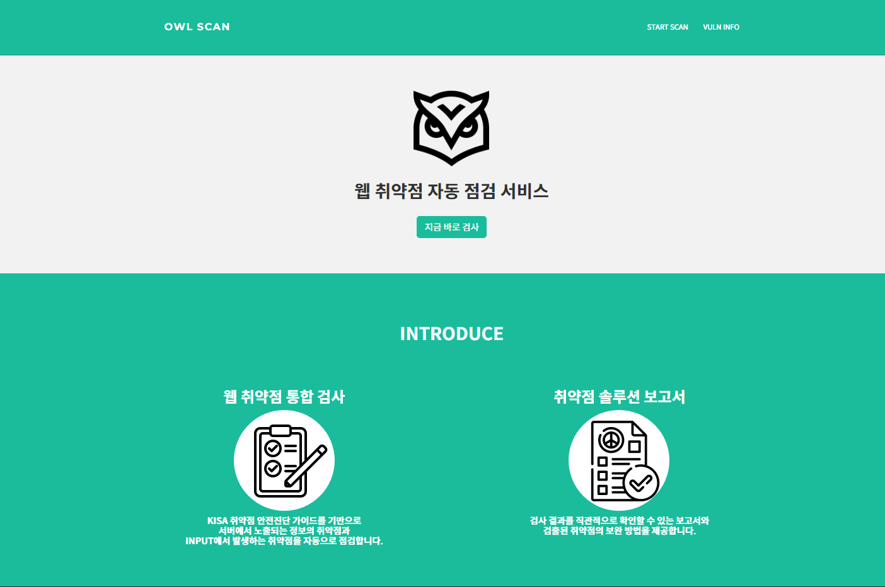
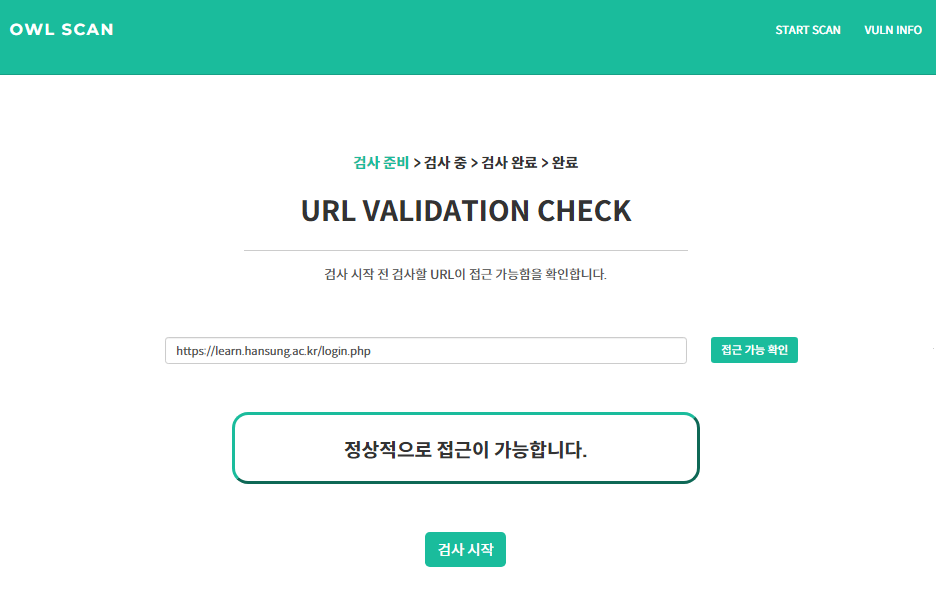
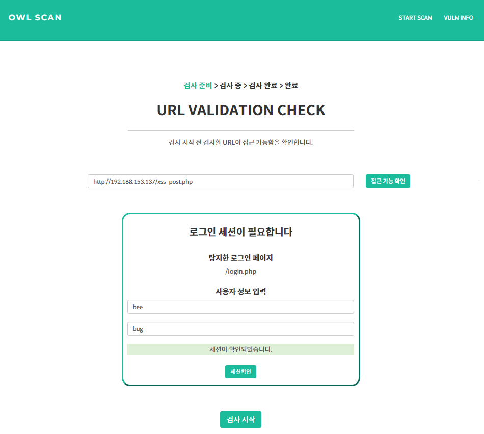
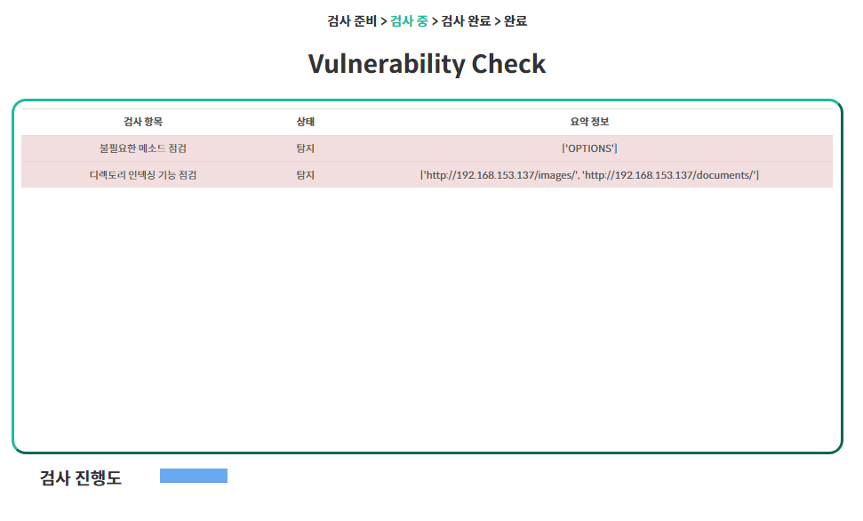
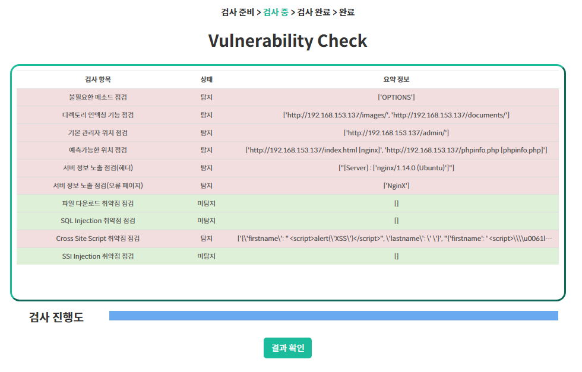
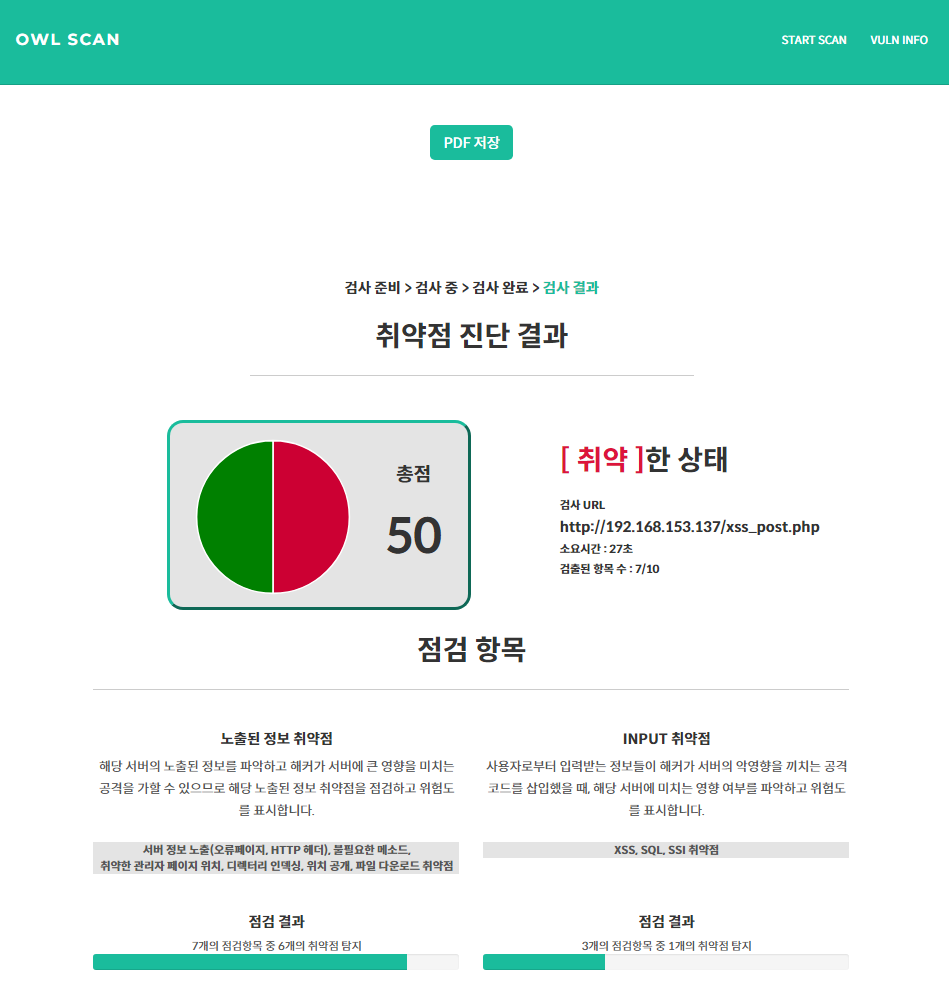
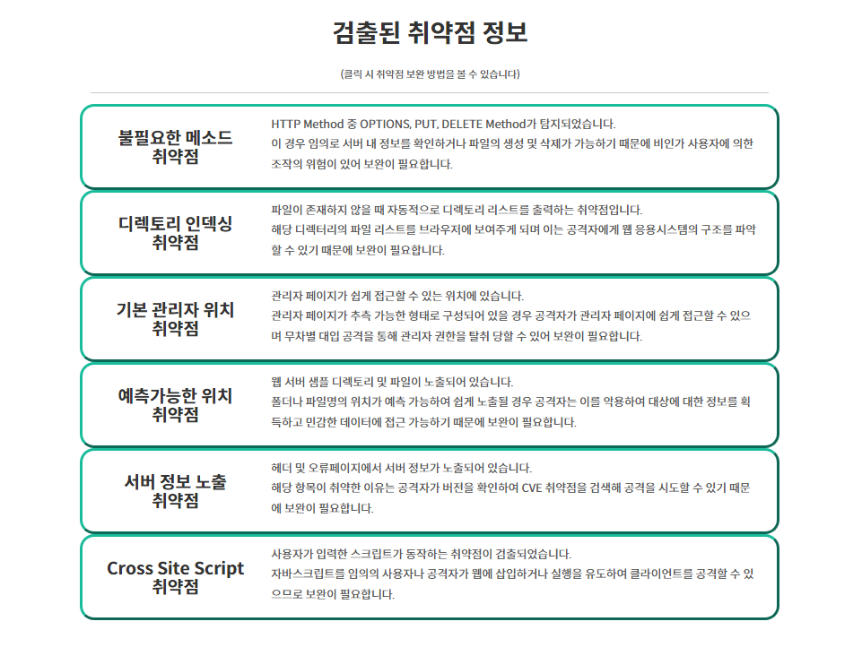
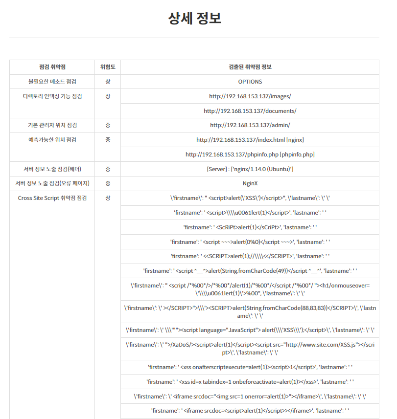
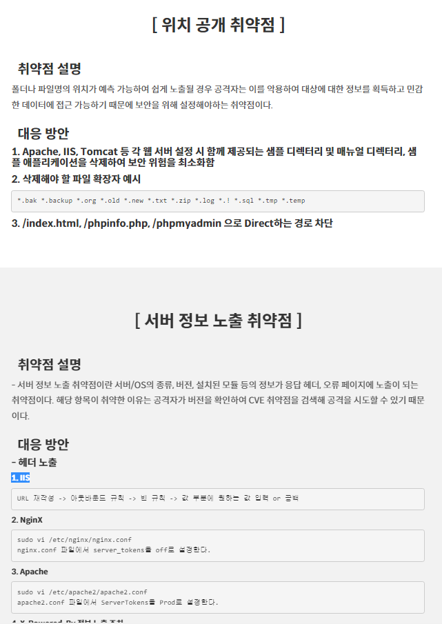
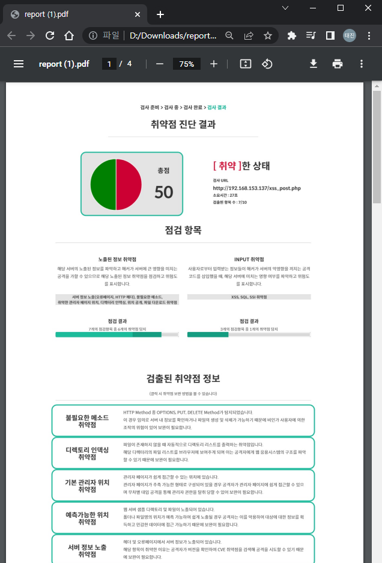

# WEB_SERVER_SECURITY_SYSTEM
2022-1 한성대 사이버보안트랙 캡스톤 디자인

---
## 프로젝트 개요

### 1) 취약점 통합 검사<br>
> 취약점마다 각기 다른 프로그램을 이용하여 검사해야 하는 불편함을 해소
### 2) 웹 어플리케이션<br>
> 웹 사이트에서 검사를 진행할 수 있어 별도의 프로그램을 설치할 필요 없음
### 3) 쉬운 사용<br>
> URL만 있으면 취약점 검사를 진행할 수 있어 간편하게 사용 가능
### 4) 취약점 솔루션 제공<br>
> 탐색된 취약점에 대한 정보와 보완 방법을 제공
### 5) 보고서 출력<br>
> 결과를 문서화하여 제공하며 탐색 결과를 점수로 표현하여 취약 정도를 쉽게 확인.
---
## 요구 기술
### 1) python<br>
> 파이썬의 requset, beautifulsoup 모듈을 이용하여 취약점 진단 코드를 구현
### 2) Django<br>
> 취약점 진단 코드를 웹 서비스로 구현하기 위해 파이썬 기반 Django 프레임 워크 사용
### 3) celery, celery-progress, rabbitmq<br>
> 웹의 동작을 백그라운드로 작업하기 위해 사용
  
 ---
 ## 실행방법
1. 실행 위치를 ./mysite로 이동
``` C
cd ./mysite
```
2. Django 서버 실행
``` C
python /manage.py runserver 
```
3. rabbitmq 실행
4. celery 실행
``` C
celery -A mysite worker -l info --pool=threads
```
---
## 기능 설명
### 1) 웹 페이지 정보 수집
- requests 모듈을 이용하여 url에 해당하는 사이트의 헤더와 소스를 가져옴.
- url을 일부 수정하여 요청을 보내거나 html 소스의 내용의 특이점을 바탕으로 취약점을 탐색.
- INPUT 취약점 확인 시 BeautifulSoup 모듈을 이용해 form이나 input을 탐색하여 파라미터로 이용.
- 포트 취약점을 탐색하기 위해 socket 모듈을 통해 도메인 네임을 ip로 변환하여 요청.

### 2) 위치 공개 취약점
- 웹 서버, DB, PHP 등의 기본페이지 확인
- 서버의 기본 페이지인 index.html이 초기 상태로 존재하는 지 확인
- /phpinfo.php, /phpMyAdmin 페이지에 접속되는지 확인하여 기본 경로가 수정되지 않아 취약함을 판단

### 3) 디렉토리 인덱싱 여부
- 인덱싱 기능을 확인하기 위해 url에서 디렉토리까지만 입력하여 Index of 페이지가 나오는지 확인.
- 알려진 웹 서버 디렉토리 명을 대입하여 Index of 페이지가 나오는지 확인. ( /icons, /images, /files 등 )
- Index of 페이지가 나타나면 해당 url은 디렉토리 인덱싱에 취약하다고 판단.

### 4) 취약한 관리자 페이지
- 대상 url의 메인 주소만 추출하여 일반적으로 관리자 페이지로 연결되는 디렉토리를 입력하여 접속 확인
( /admin, /manager, /system 등 )
- WAS마다 기본 설정되는 관리자 페이지를 입력해보고 포트를 다르게 사용하는 경우를 생각해 소켓을 통하여 도메인에 따른 ip를 찾아 포트를 더하여 입력해 접속 확인 
- 해당 페이지에 접속이 성공하면 해당 url은 취약하다고 판단

### 5) 서버 정보 탐색 
- url에 get 요청 시 헤더에 "Server"나 "X-Powered By"가 존재함을 확인하여 서버 정보가 노출되는 지 식별
- 강제로 오류를 발생 시켜 오류 페이지 내에 서버 식별자를 확인하여 취약함을 파악.

### 6) 불필요한 메소드 확인
- url을 options 메소드를 이용해 요청을 보낸 뒤 응답 헤더에 "Allow", "Access-Control-Allow-Methods", 'Public"가 존재하는 지 확인
- 헤더 value에 OPTIONS 외에 PUT, DELETE, TRACE 등이 추가로 포함되어 있으면 매우 취약함을 판별

### 7) 파일 다운로드 취약점
- <a> 속성의 href에 file, filename, path등을 찾아서 파일을 다운로드 받는 url임을 식별 
- 해당 url에 다른 파라미터는 유지하고 경로가 들어가는 파라미터값을 수정하여 다른 파일에 접근하여 다운로드
- 다운로드 시 헤더에 "Content-Disposition"이 포함되어 있으면 성공적으로 다운 받을 수 있음으로 취약함 판단
- /etc/passwd, /winnt/win.ini 등의 서버관련 파일을 다운로드 시도하며 "/../../", "//../..//", "%2f%2e%2e" 등을 이용하여 상위 루트로 진입하고 필터링을 우회하여 다운로드 시도
  
### 8) SQL Injection
- &lt;input&gt;, &lt;select>, &lt;submit> 등 Key-Value 형식으로 통신 시 폼으로 전송되는 파라미터들을 탐색
- 폼에 오류를 발생시키는 PAYLOAD를 주입해 DB 자체 오류 메세지 출력을 통해 취약함 식별
- 결과 값이 무조건 참, 거짓인 PAYLOAD 쌍( ' or 1=1--, ' or 1=0-- )을 주입해 결과의 차이가 있는지 식별

### 9) Cross Site Script
- &lt;input>, &lt;select>, &lt;submit> 등 Key-Value 형식으로 통신 시 폼으로 전송되는 파라미터들을 탐색
- 폼에 스크립트가 포함된 명령어를 주입하여 요청하고 응답에서 스크립트가 실행되는 지 확인하여 취약점 식별
- &lt;script>alert('XSS')&lt;/script>, &lt;script>\u0061lert(1)&lt;/script> 등

### 10) SSI Injection
- 요청 경로가 SSI를 사용하는 shtml 인지 확인하고 입력 가능한 폼 탐색 
- 폼에 SSI 지시자를 주입하여 지시자가 실행되는지 확인하여 취약점 식별
- &lt;!--#exec cmd="cat /etc/passwd" --> 등  
  
---
## 구현 화면
### 메인페이지

##### 메인페이지는 간단한 기능 소개와 검사 시작 버튼으로 구성


  
### 검사 준비 페이지

##### URL 입력 페이지는 입력한 URL의 유효, 접근 가능을 확인하며 로그인 세션 필요시 로그인 페이지의 내용을 이용해 사용자의 입력을 요구 

* URL이 바로 접근 가능한 경우 

  
* 로그인 세션이 필요한 경우

  
  ### 검사 진행 페이지
  
  ##### 검사 진행 페이지에서는 실시간으로 검사 항목에 대한 탐지 현황을 확인할 수 있으며 탐지된 경우 요약 정보를 알려주며 붉은색으로 표시되고 미탐지의 경우 초록색으로 표시하여 가시적으로 알 수 있도록 구성하였다. 검사가 끝났을 시 결과 확인 버튼이 나타난다.
  
  * 검사가 진행 중인 경우
  
  
   * 검사 진행이 완료된 경우
  
  
  ### 검사 완료 페이지
  ##### 검사 완료 페이지는 검사 결과를 바탕으로 총 점수, 소요 시간, 검출 항목 수를 나타내고 점검 항목에 따른 간략한 설명과 검출된 취약점 수를 BAR형태로 보여준다. 아래 검출된 취약점 정보에서는 발견된 취약점에 대한 간략한 설명을 나타내고 클릭 시 취약점 상세 정보와 그에 따른 보완 방법에 대해 설명한다.(다음페이지) 상세 정보에서는 검사에서 발견된 취약정보, URL, PAYLOAD를 취약 항목 별로 나타낸다.
  
  
  
  
  ### 취약점 정보 및 PDF 저장
  * 취약점 상세 정보 페이지는 취약점 별 설명과 보완 방법을 나타내고 있다.
  
  * PDF 저장 버튼을 이용하면 해당 검사 결과를 PDF로 저장하여 확인할 수 있다. 
  
  
  ---
